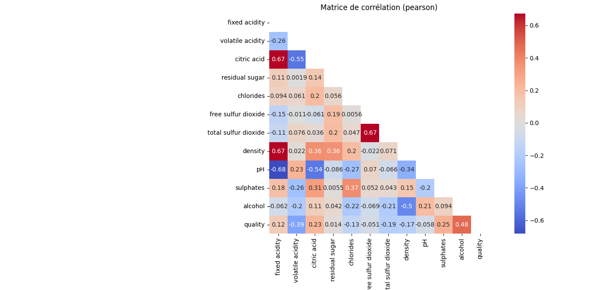
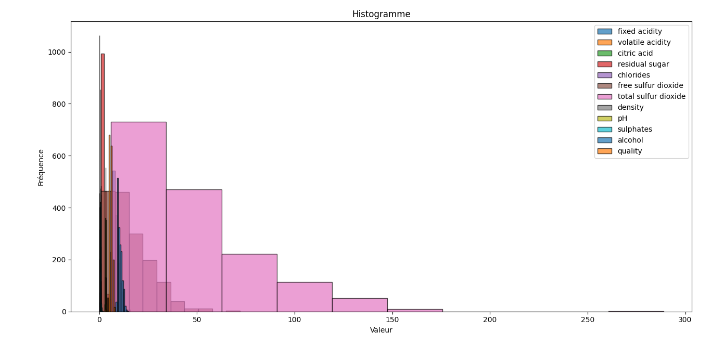
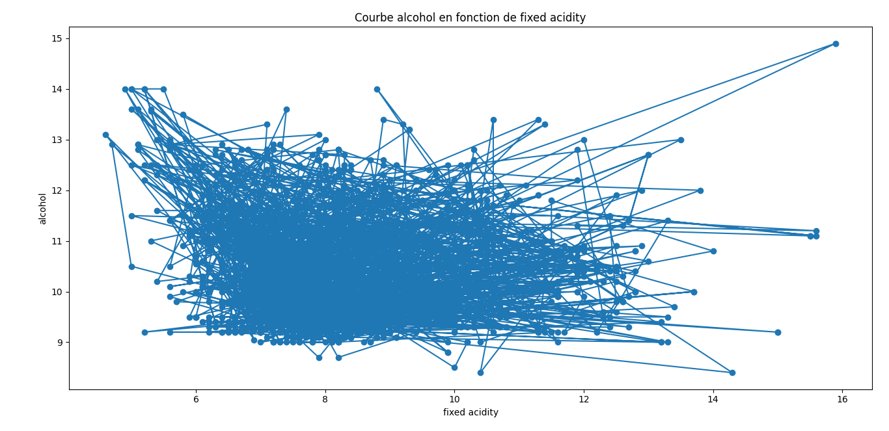
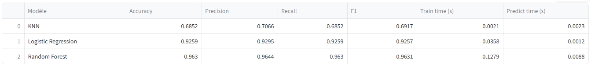

# trainedml

> Modular machine learning framework for Python - train, benchmark, and visualize ML models with a unified API, CLI, and web interface.

<p align="left">
  <a href="https://pypi.org/project/trainedml/"></a>
  <a href="https://pypi.org/project/trainedml/"></a>
  <a href="https://opensource.org/licenses/MIT"></a>
  <a href="https://diamankayero.github.io/trainedml/"></a>
  <a href="https://trainedml.streamlit.app"></a>
  <a href="https://github.com/diamankayero/trainedml/actions/workflows/workflow.yml"></a>
</p>

---

## Table of Contents

- [Overview](#overview)
- [Installation](#installation)
- [Quickstart](#quickstart)
- [Features](#features)
- [API Reference](#api-reference)
- [CLI Usage](#cli-usage)
- [Architecture](#architecture)
- [Testing](#testing)
- [Documentation](#documentation)
- [Contributing](#contributing)
- [License](#license)

<p align="center">
   
   
   
   
</p>

---

## Overview

**trainedml** est un package Python modulaire pour entraîner, comparer et visualiser des modèles de machine learning sur des jeux de données classiques ou personnalisés. Il offre une API unifiée, une interface en ligne de commande et une application web interactive Streamlit pour des workflows ML complets.

---

## Installation

```bash
pip install trainedml
```

Or install from source:

```bash
git clone https://github.com/diamankayero/trainedml.git
cd trainedml
pip install -e .
```

**Requirements:** Python 3.9+

---

## Quickstart

```python
from trainedml import Trainer, compare

# Train on a built-in dataset (loaded locally, no network needed)
trainer = Trainer(dataset="iris", model="random_forest")
trainer.fit()

# Evaluate - metrics match the task (classification or regression)
print(trainer.evaluate())

# Predict
print(trainer.predict([[5.1, 3.5, 1.4, 0.2]]))

# Compare every suitable model with 5-fold cross-validation, in one line
print(compare(dataset="wine", cv=5))
```

---

## Features

- **Unified API** - train, evaluate, predict, save/load with a single `Trainer` class
- **One-line model comparison** - `compare(dataset="wine", cv=5)` returns a sorted DataFrame with cross-validated scores and timings
- **Automatic preprocessing** - imputation, scaling, one-hot encoding, refit per CV fold (no data leakage)
- **Any scikit-learn estimator** - `Trainer(model=SVC())` works out of the box, plus built-in KNN, Logistic Regression, Random Forest, Linear/Ridge/Lasso
- **Built-in datasets offline** - Iris and Wine load locally via scikit-learn; any remote CSV via URL (cached)
- **Task auto-detection** - classification vs regression, with matching metrics (accuracy/precision/recall/F1 or R²/MSE/RMSE/MAE)
- **Benchmarking** - single split or K-fold cross-validation, with timing and parallelization
- **Model persistence** - `trainer.save("model.joblib")` / `Trainer.load(...)`, batch prediction from the CLI
- **EDA report** - one self-contained HTML report: correlations, distributions, missing values, outliers, normality, VIF
- **Visualization** - heatmaps, histograms, line plots, boxplots, bivariate charts
- **CLI** - automate ML pipelines from the terminal
- **Streamlit webapp** - interactive web interface for exploration and prediction

---

## API Reference

### `Trainer`

The main entry point for the framework.

```python
from trainedml import Trainer

trainer = Trainer(dataset="iris", model="knn")
trainer.fit()
scores = trainer.evaluate()
predictions = trainer.predict([[5.1, 3.5, 1.4, 0.2]])
```

The train/test split is handled internally by the package (`DataLoader.split`) - no need to call scikit-learn yourself. The splits are available as attributes, and you can re-split with a new seed without recreating the trainer:

```python
trainer.X_train, trainer.X_test, trainer.y_train, trainer.y_test  # after fit()

# Vary the seed to check model stability across splits
for s in range(5):
    print(trainer.fit(seed=s).evaluate())
```

Train on a custom remote dataset, in-memory data, hyperparameters, or any scikit-learn estimator:

```python
# Remote CSV
trainer = Trainer(
    url="https://archive.ics.uci.edu/ml/machine-learning-databases/wine-quality/winequality-red.csv",
    target="quality",
    model="logistic"
)

# In-memory data (X, y)
trainer = Trainer(X=my_dataframe, y=my_target, model="ridge")

# Hyperparameters
trainer = Trainer(dataset="wine", model="knn", model_params={"n_neighbors": 7})

# Any scikit-learn estimator
from sklearn.svm import SVC
trainer = Trainer(dataset="iris", model=SVC(kernel="rbf"))
```

Save and reload a trained model:

```python
trainer.fit().save("model.joblib")
restored = Trainer.load("model.joblib")
restored.predict([[5.1, 3.5, 1.4, 0.2]])
```

### `compare`

Compare every suitable model (auto-detected task) with cross-validation, in one line:

```python
from trainedml import compare

df = compare(dataset="wine", cv=5)      # built-in dataset
df = compare(X=X, y=y, cv=5)            # your own data
print(df)  # sorted DataFrame: metrics ± std, fit/predict times
```

### `DataLoader`

```python
from trainedml.data.loader import DataLoader

X, y = DataLoader().load_dataset(name="wine")
```

### `KNNModel` (and other models)

```python
from trainedml.models.knn import KNNModel

model = KNNModel(n_neighbors=3)
model.fit(X_train, y_train)
predictions = model.predict(X_test)
```

### `Benchmark`

```python
from trainedml.benchmark import Benchmark
from trainedml.models.knn import KNNModel
from trainedml.models.random_forest import RandomForestModel

models = {"knn": KNNModel(), "rf": RandomForestModel()}
bench = Benchmark(models)
results = bench.run(X_train, y_train, X_test, y_test)
print(results)
```

### `Visualizer`

```python
from trainedml.visualization import Visualizer

viz = Visualizer(X)
fig = viz.heatmap()
fig.show()
```

---

## CLI Usage

```bash
# Show help
python -m trainedml --help

# Benchmark all models on Iris (5-fold cross-validation)
python -m trainedml --benchmark --dataset iris --cv 5

# Train KNN on Wine and save the model
python -m trainedml --model knn --dataset wine --save model.joblib

# Predict on a new CSV with a saved model
python -m trainedml --load model.joblib --input new_data.csv --output predictions.csv

# Visualize correlation heatmap
python -m trainedml --dataset iris --show
```

### Interactive Webapp

```bash
streamlit run trainedml_webapp/src/app.py
```

Or visit the hosted version: [trainedml.streamlit.app](https://trainedml.streamlit.app)

### Web API (FastAPI)

Serve trainedml over HTTP for any frontend (HTML/JS, React, mobile):

```bash
pip install "trainedml[web]"
uvicorn webapp_api.api:app --reload
# demo page: http://localhost:8000   interactive docs: http://localhost:8000/docs
```

See [webapp_api/README.md](webapp_api/README.md) for routes and details.

---

## Architecture

```
trainedml/
├── src/trainedml/
│   ├── __init__.py        # Trainer API (train/evaluate/predict/save/load)
│   ├── compare.py         # One-line model comparison (cross-validated DataFrame)
│   ├── preprocessing.py   # Automatic preprocessing (impute, scale, one-hot)
│   ├── tasks.py           # Task detection (classification vs regression)
│   ├── benchmark.py       # Model benchmarking (single split or K-fold CV)
│   ├── evaluation.py      # Evaluation metrics
│   ├── report.py          # Self-contained HTML EDA report
│   ├── analyzer.py        # Exploratory data analysis
│   ├── cli.py             # CLI interface
│   ├── figure.py          # Figure generation
│   ├── visualization.py   # Visualization facade (Visualizer)
│   ├── data/              # Data loading (offline built-ins + remote CSV)
│   ├── models/            # ML models (KNN, LR, RF, regressors...)
│   └── viz/               # Advanced visualizations
├── doc/                   # Sphinx documentation
├── examples/              # Runnable examples + notebooks (quickstart, compare, EDA report)
├── tests/                 # Unit tests
├── webapp_api/            # HTTP API (FastAPI) + HTML/JS demo page
└── CHANGELOG.md
```

---

## Testing

```bash
pytest tests/
```

---

## Documentation

- [Online docs (GitHub Pages)](https://diamankayero.github.io/trainedml/)
- [Usage guide](DOC_UTILISATION.md)
- [Webapp docs](trainedml_webapp/doc/streamlit_app.md)

---

## Contributing

Contributions are welcome!

1. Fork the project
2. Create your feature branch: `git checkout -b feature/my-feature`
3. Commit your changes: `git commit -m 'Add my feature'`
4. Push to the branch: `git push origin feature/my-feature`
5. Open a Pull Request

For bugs or suggestions, open an [issue](https://github.com/diamankayero/trainedml/issues).

---

## License

MIT - see [LICENSE](LICENCE) for details.
