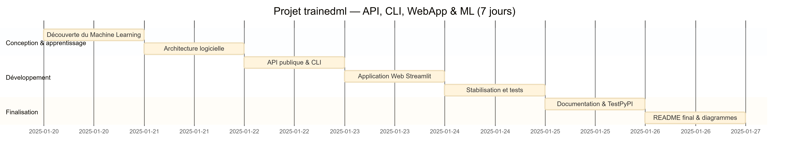

# trainedml

`trainedml` est un package Python qui fournit des outils simples pour **charger des jeux de données publics**, **entraîner et comparer des modèles de machine learning**, et **visualiser les résultats** de manière intuitive.

[](https://pypi.org/project/trainedml/)
[](https://pypi.org/project/trainedml/)
[](https://opensource.org/licenses/MIT)

---

## 📦 Installation

### Depuis PyPI (recommandé)

```bash
pip install trainedml
```

### Depuis les sources

```bash
git clone https://github.com/diamankayero/trainedml_module.git
cd trainedml
pip install -e .
```

---

## 🚀 Fonctionnalités principales

* **Chargement de données** : jeux de données publics (Iris, Wine) ou CSV distant
* **Modèles de classification** : KNN, Régression logistique, Random Forest
* **Modèles de régression** : Linéaire, Ridge, Lasso, KNN, Random Forest
* **Évaluation** : accuracy, precision, recall, F1 (classification) — R², MSE, RMSE, MAE (régression)
* **Benchmark** : comparaison de plusieurs modèles en parallèle avec timing
* **Analyse exploratoire** : distribution, corrélation, valeurs manquantes, outliers, normalité, multicolinéarité, profiling
* **Visualisations** : heatmap, histogrammes, courbes, boxplots, bivarié

---

## 📊 Exemples de visualisations

### Matrice de corrélation (Heatmap)


### Histogramme des variables


### Courbe (Line Plot)


### Comparaison de modèles (Benchmark)


---

## 🧪 Exemple d'utilisation

```python
from trainedml.data.loader import DataLoader
from trainedml.models.knn import KNNModel
from trainedml.evaluation import Evaluator
from trainedml.visualization import Visualizer
from sklearn.model_selection import train_test_split

# Chargement des données
X, y = DataLoader().load_dataset(name="iris")
X_train, X_test, y_train, y_test = train_test_split(X, y, test_size=0.3, random_state=42)

# Entraînement
model = KNNModel()
model.fit(X_train, y_train)
y_pred = model.predict(X_test)

# Évaluation
scores = Evaluator.evaluate_all(y_test, y_pred)
print(scores)
# {'accuracy': 0.97, 'precision': 0.97, 'recall': 0.97, 'f1': 0.97}

# Visualisation
viz = Visualizer(X)
viz.heatmap()
```

### CLI

```bash
# Entraîner un Random Forest sur Iris
python -m trainedml --dataset iris --model random_forest --show

# Benchmark de tous les modèles sur Wine
python -m trainedml --dataset wine --benchmark --show

# Histogramme
python -m trainedml --dataset iris --histogram --show
```

---

## 🏗️ Architecture du projet

```
src/trainedml/
├── __init__.py          # Trainer, main
├── analyzer.py          # DataAnalyzer (EDA complet)
├── benchmark.py         # Benchmark multi-modèles
├── cli.py               # Interface en ligne de commande
├── evaluation.py        # Evaluator (classification + régression)
├── figure.py            # Figure multi-backend (matplotlib/plotly)
├── visualization.py     # Visualizer (wrapper)
├── data/
│   └── loader.py        # DataLoader (iris, wine, CSV)
├── models/
│   ├── base.py          # BaseModel, BaseRegressor (ABC)
│   ├── knn.py           # KNNModel
│   ├── logistic.py      # LogisticModel
│   ├── random_forest.py # RandomForestModel
│   └── regressors.py    # Linear, Ridge, Lasso, KNN, RF regressors
├── utils/
│   └── factory.py       # Utilitaires
└── viz/
    ├── heatmap.py, histogram.py, line.py, boxplot.py
    ├── correlation.py, distribution.py, missing.py
    ├── outliers.py, normality.py, multicollinearity.py
    ├── bivariate.py, target.py, profiling.py
    └── vizs.py          # Classe de base
```

---

## 📅 Diagramme de Gantt du projet



---

## ✅ Tests

```bash
pip install pytest
python -m pytest tests/ -v
```

**54 tests** couvrant : modèles, visualisations, évaluation, benchmark, CLI, analyseur.

---

## 📌 Statut du projet

* ✔️ Publié sur **[PyPI](https://pypi.org/project/trainedml/0.1.1/)**
* ✔️ 54/54 tests passent
* ✔️ Documentation numpy/scipy style
* 🔄 En développement actif

---

## 📄 Licence

MIT — voir [LICENCE](LICENCE)

---

## 👤 Auteur

**diamankayero** — [GitHub](https://github.com/diamankayero/trainedml_module)
